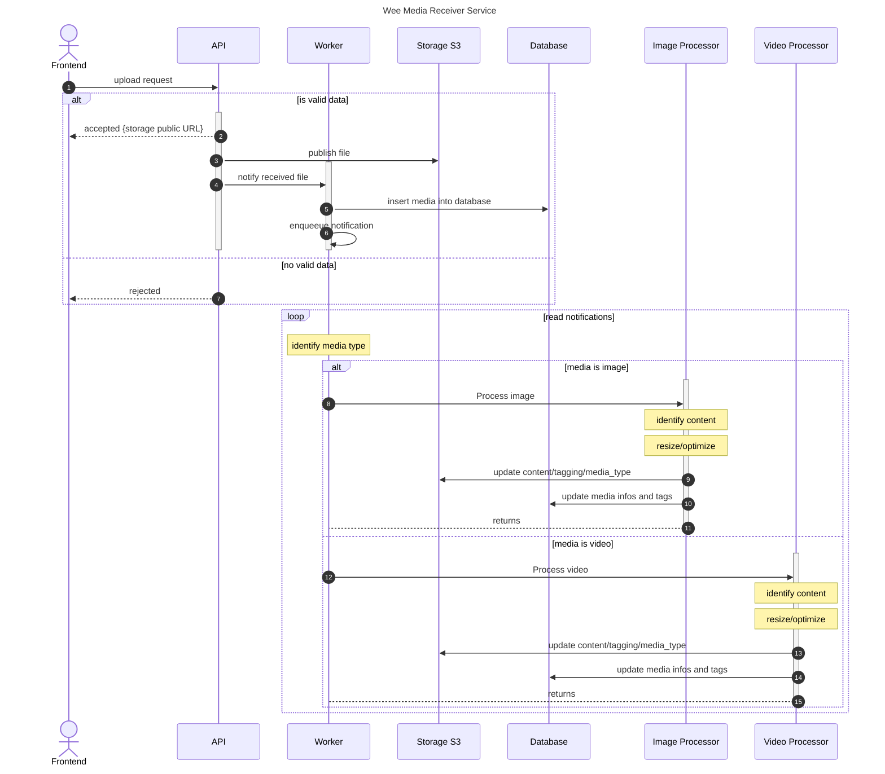

# Python Project Template

[](https://github.com/guionardo/python-template/actions/workflows/python_test_and_lint.yml)
[](https://github.com/guionardo/python-template/actions/workflows/codeql-analysis.yml)

Add your files here

## Attention

The test and linting action will check for coverage minimum of 50%.

The COVERAGE.md file is automatically generated.

## Makefile

Ready to work

### make updatepip (install needed packages)

Make sure pipenv is installed before run this command. 

```bash
pip install --user pipenv
```

```bash
Running $ pipenv lock then $ pipenv sync.
Locking [dev-packages] dependencies…
Locking [packages] dependencies…
Updated Pipfile.lock (18d334)!
Installing dependencies from Pipfile.lock (18d334)…
  🐍   ▉▉▉▉▉▉▉▉▉▉▉▉▉▉▉▉▉▉▉▉▉▉▉▉▉▉▉▉▉▉▉▉ 23/23 — 00:00:07
```


### make test (run unit tests)

```bash
python -m unittest
.
----------------------------------------------------------------------
Ran 1 test in 0.000s

OK
```

### make coverage (run unit tests and generates COVERAGE.md)

```bash
bash .github/scripts/generate_coverage.sh
.
----------------------------------------------------------------------
Ran 1 test in 0.000s

OK
Wrote XML report to coverage.xml
```

### make requirements (updates requirements.txt)

```bash
pipreqs --force
INFO: Successfully saved requirements file in /home/guionardo/dev/github.com/guionardo/python-template/requirements.txt
```

## Sequence Diagram



## Priorização

POST /video/{id_video}

  1. Identificar se o vídeo existe no S3
  2. Existindo, retorna 202 ACCEPTED
  3. Enfileira o id_video para processamento

Processamento

  1. Download do vídeo do S3
  2. Análise do conteúdo do vídeo e geração de tags
  3. Análise e otimização do vídeo
  4. Upload do novo vídeo para o S3
  5. Notificação para o site bomperfil sobre o processo terminado do vídeo, com o novo nome de arquivo e as tags
  6. Com o aceite do bomperfil, exclui o arquivo anterior do S3